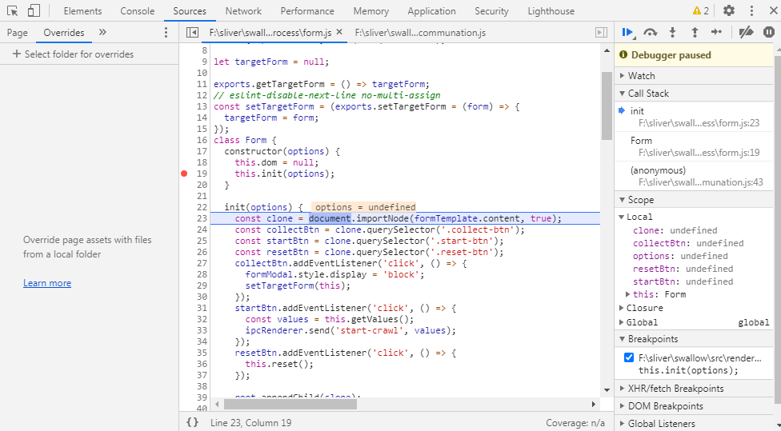
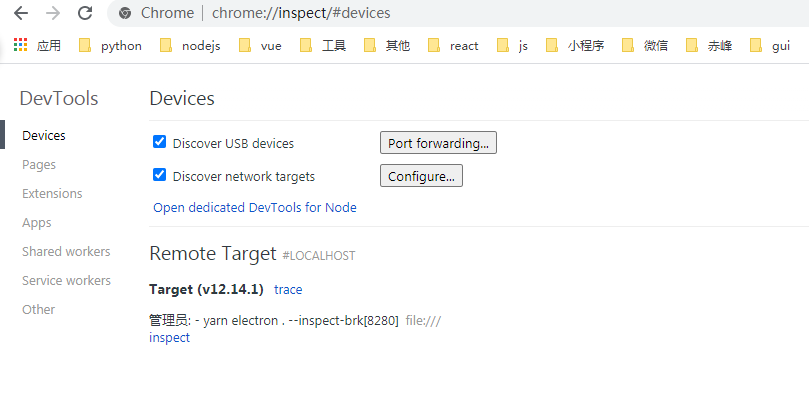
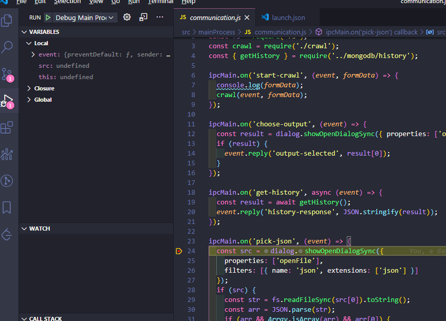

# Electron 应用的调试

本文介绍 Electron 应用开发过程中的调试

## render Process

render Process 的运行环境就是 Chrome 浏览器，所以 Devtools 就是理想的调试工具。可以通过在创建窗口时打开开发者工具：`mainWindow.webContents.openDevTools();`，或者在运行窗口的菜单栏点击 View-->Toggle Developer Tools。Devtools 的 sources 选项打开需要调试的 js，添加断点即可.



## main Process

Devtools 只能调试运行在浏览器环境中的代码，而不能调试运行在 node 环境下的代码。为了调试 main process 的代码，需要在启动应用时添加`--inspect`或者`--inspect-brk`参数,并借助外部调试器(chrome).

```Shell
electron . --inspect
```

> `--inspect`和`--inspect-brk`的区别在于后者会在第一行打上断点

然后打开 Chrome,在地址栏输入`chrome://inspect`，就能看到：



在 Devices->Remote Target 中能看到需要调试的程序，点击 inspect 即可进入调试界面


还有一种调试 main process 的方法是借助[VSCode](https://code.visualstudio.com/)。在项目根目录创建`.vscode/launch.json`，并配置如下:

```json
{
  "version": "0.2.0",
  "configurations": [
    {
      "name": "Debug Main Process",
      "type": "node",
      "request": "launch",
      "cwd": "${workspaceFolder}",
      "runtimeExecutable": "${workspaceFolder}/node_modules/.bin/electron",
      "windows": {
        "runtimeExecutable": "${workspaceFolder}/node_modules/.bin/electron.cmd"
      },
      "args": ["."],
      "outputCapture": "std"
    }
  ]
}
```

然后在代码中添加断点，并在 VScode 中启动运行


