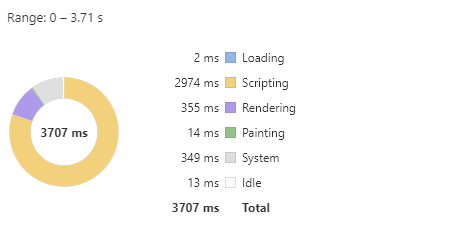

# HTML 中超大数据量的渲染性能优化

如果要在 html 中渲染 100000 条数据，我们该怎么做

## 一次性渲染

最简单的方法就是一次性添加。

```html
<!DOCTYPE html>
<html lang="en">
  <head>
    <meta charset="UTF-8" />
    <meta name="viewport" content="width=device-width, initial-scale=1.0" />
    <title>Document</title>
  </head>
  <body>
    <ul id="container"></ul>
  </body>
  <script>
    let now = Date.now();
    const total = 100000;
    let ul = document.getElementById('container');
    //这里用创建文档片段的方法，已经做了一点优化，尽管效果并不明显
    let fragment = document.createDocumentFragment();
    for (let i = 0; i < total; i++) {
      const li = document.createElement('li');
      li.innerText = i;
      fragment.appendChild(li);
    }
    ul.appendChild(fragment);
    console.log('JS运行时间：', Date.now() - now);
    setTimeout(() => {
      console.log('总运行时间：', Date.now() - now);
    }, 0);
  </script>
</html>
```

当我们运行 html 时，比较长的一段时间页面空白，然后一次性加载完成；当我们滚动页面时，也会出现空白闪动的现象。

关于计算 js 运行时间和总运行时间，需要了解以下 js 引擎和浏览器渲染进程的知识。这里简单地说一下，就是 js 引擎和渲染引擎是互斥的，不能同时执行，在 Event Loop 中，当 JS 引擎所管理的执行栈中的事件以及所有微任务执行完后，才会触发渲染线程对页面进行渲染。而以上代码中的`setTimeout`的回调函数会被加入到下一次的事件循环，在浏览器渲染完成之后执行。关于浏览器进程和线程的，可以参见[从浏览器多进程到 JS 单线程，JS 运行机制最全面的一次梳理](https://segmentfault.com/a/1190000012925872),这里就不深入了。

经过执行，可以得到 JS 运行时间为 253 毫秒，而总运行时间达 6105 毫秒。同时，我们监控以下`performance`，可以得到以下结果：


可以看出，性能瓶颈在渲染阶段，而不是 js 运行。

## 分批多次渲染

既然瓶颈在渲染阶段，那分批多次渲染会不会更好？

```html
<!DOCTYPE html>
<html lang="en">
  <head>
    <meta charset="UTF-8" />
    <meta name="viewport" content="width=device-width, initial-scale=1.0" />
    <title>Document</title>
  </head>
  <body>
    <ul id="container"></ul>
  </body>
  <script>
    const ul = document.getElementById('container');
    const total = 100000;
    const once = 20;
    const times = total / once;
    let idx = 0;
    function loop(curIndex) {
      if (curIndex < times) {
        setTimeout(() => {
          let fragment = document.createDocumentFragment();
          for (let i = 0; i < once; i++) {
            const li = document.createElement('li');
            li.innerText = curIndex + ':' + i;
            fragment.appendChild(li);
          }
          ul.appendChild(fragment);
        }, 0);
        loop(++curIndex);
      }
    }
    loop(idx);
  </script>
</html>
```

这里单次渲染 20 条，分 5000 次渲染完成。因为`setTimeout`的回调函数会在下一次事件循环中执行，所以不会造成页面长时间空白。即 js 生成 20 条数据，浏览器渲染 20 条数据，然后再生成再渲染，避免了一次性大量渲染。



可以看出渲染时间大大地缩短了

但是拖动滚动条还是会出现空白闪动的效果。这是因为`setTimeout`的延迟时间并不精确。

## requestAnimationFrame

```html
<!DOCTYPE html>
<html lang="en">
  <head>
    <meta charset="UTF-8" />
    <meta name="viewport" content="width=device-width, initial-scale=1.0" />
    <title>Document</title>
  </head>
  <body>
    <ul id="container"></ul>
  </body>
  <script>
    const ul = document.getElementById('container');
    const total = 100000;
    const once = 20;
    const times = total / once;
    let idx = 0;
    function loop(curIndex) {
      if (curIndex < times) {
        window.requestAnimationFrame(() => {
          let fragment = document.createDocumentFragment();
          for (let i = 0; i < once; i++) {
            const li = document.createElement('li');
            li.innerText = curIndex + ':' + i;
            fragment.appendChild(li);
          }
          ul.appendChild(fragment);
          loop(++curIndex);
        });
      }
    }
    loop(idx);
  </script>
</html>
```

该方法需要传入一个回调函数作为参数，该回调函数会在浏览器下一次重绘之前执行。这样就等于把确定执行时间的问题交给浏览器自身，开发者不必去考虑延迟时间的精确性问题。

关于重绘和回流：**当 Render Tree 中部分或全部元素的尺寸、结构、或某些属性发生改变时，浏览器重新渲染部分或全部文档的过程称为回流；当页面中元素样式的改变并不影响它在文档流中的位置时（例如：color、background-color、visibility 等），浏览器会将新样式赋予给元素并重新绘制它，这个过程称为重绘**。

简单地说，只有样式改变，就发生重绘，布局改变，就发生回流。可以说，回流必定重绘，重绘不一定回流。

以上 html 的执行过程就是：每一次重绘就生成 20 条数据，然后渲染 20 条数据。因为时间由浏览器自身控制，就不会造成空白闪现的效果。
